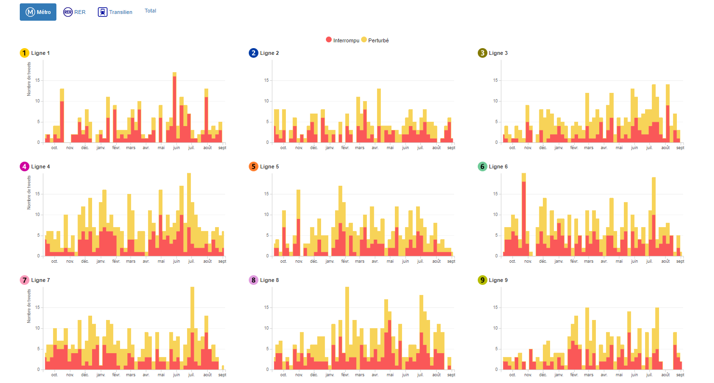

# Trafic interrompu !

Une petite analyse des tweets des comptes des lignes de transport (métro, RER, Transilien) d'Île-de-France annonçant des perturbations ou des interruptions du trafic.

Allez ici pour voir les graphiques -> https://dreamrs.github.io/tweets-transports/

Aperçu:

### A propos

Les tweets ont été collectés avec le package [rtweet](https://rtweet.info/).

Les pictogrammes des lignes viennent de la [plateforme Open data de la RATP](https://data.ratp.fr/explore/dataset/pictogrammes-des-lignes-de-metro-rer-tramway-bus-et-noctilien/images/).

Les graphiques ont été réalisés avec le package [billboarder](https://github.com/dreamRs/billboarder).

